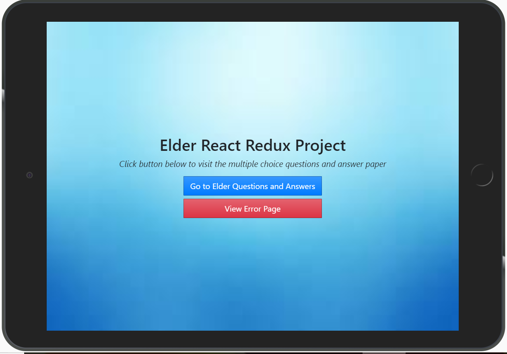
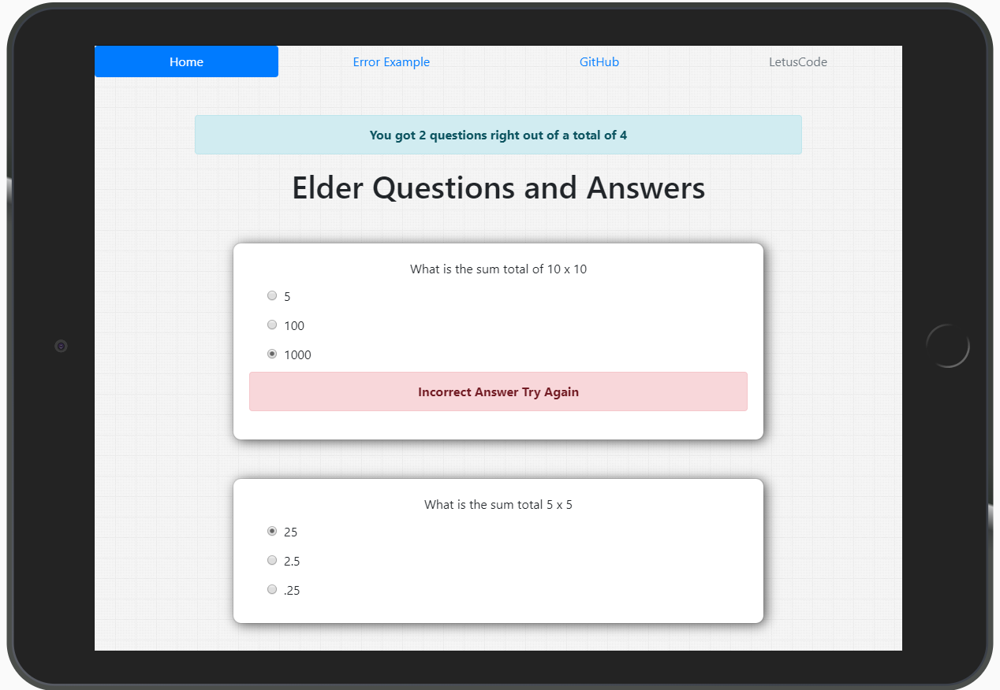

# The React Redux Elder Project

## This demonstration is a build copy and therefore can be run from the node server alone as a production react build has taken place. All client files are served from the react build folder and supplied to the node server.

## Project View






```
git clone https://github.com/jwill9999/elder.git

cd into elder >>> npm install

npm run start

open browser http:localhost:5000
```
